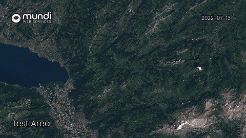

# Project: X-Terra Hackathon 2023
X-TERRA: Cross-Terrain Emergency Response and Relief Assistance\
This repository contains a prototype of the project for Cassini Hackathon 2023 for the challenge ***"Enable cross terrain mobility"***.

Issuse to solve\
There is always a risk of crisis in the world, and there is a strictly need to obtain fast and effective way to deploy and move assets nevertherless of destination and atmospheric situation. It is crucial to get a tool focused in support of mission planning, understanding of terrain and capable of ploting routes for navigation, logistic and special crisis missions. 

Project Idea\
Create full pleaged app which will enable navigation on off road by using satelite photos supported by open source service, to search and lead the most optimalised off-road routing way for rough terrain mission planning. By obtaining satelite data about vegetation, moisture, all kind of water reservoirs compared to other open sources which gave information about elevation levels, weather conditions and if it is needed - streets. All of this data will be processed to calculate a difficultness of aproach for certain areas of terrains, and thanks to that plot a route which will be most fitted for particular mission group (amphibious vehicles, allterrain cars or heavy transport vehicles).That's is why project X-Terra want to gave a idea and first impresion of solution which can be use by a various assets like humanitarian convoys, firefighters emergency forces, forest protection and supervision service and even also can find helpful for military use cases.

Data used\
X-TERRA use various Sentinel 2 layers system to find the most important data about terraint to be traveled.
> SCL \
> SCL ONLY WATER \
> MOISTURE INDEX \
> VEGETATION INDEX\
> NATURAL COLOR

Source services\
> mundi
> Openstreetmap\
> EUDEM v1 - Copernicus Land Monitoring System\
> Open weather map  (TO DO)

Use cases of data\
Providing stable and effective route between two or more points can be a quite challengous task, and to have a satysfiying output we had connected multiple layers of sattelite images to calculate a direct cost of crossing a particular coordinates. By establishing a multidimension cost table we have crated an array of masks each of which adds an appropriate weight to particular coordinate. For instance moisture layer provide information about condition of agricultural plain detected from SCL layer - it gave us a oppurtonity to determine if a soil is dry and passable or a theoretical convoy would stuck in mud.

Example of used data weights

| SCL layer  | Moisture Index | Geographic photo | Vegetation index |
| ------------- | ------------- |------------- |------------- |
| Bare soil  | Drought  | Forests | Vegetation grow status |
| Vegetation  | Water stress | Plains | Vegetation coverage |
| Water | Hight canopy | Urbanisation | 
| Snow/Ice|  | Water resorvoirs |
| Clouds|||

Sentinels sattelite constelation revisit particular area in 5 days interval - which mostly gave up to date information about geografic situation - and even with a support of other sources (weather forecast, prolonged data collection) can enable prediction of situation when data is unsufficent (Cloud issuses). (Determine future using past images, weather forecast and lower than satelite amplitude photos). Thank to that we can establish a reliable source of information about changing state of offroad terrain. 

Tested region of Europe\

Layer used for region analysis\

Routing
Route is plotet by using a R* type algorithm which determinate optimal route between two points A-B. 
Example of road guided, based on the cost resulting from terrain conditions\

